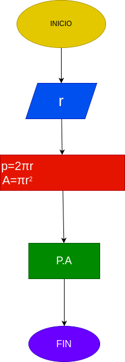

# Programa #1
Programa para calcular el área y el perímetro de un circulo de radio r

# Análisis  

## Input
### Variables de entrada
r: radio del circulo
### processing
p=2πr

a=area del circulo
a=πrr

# output
a,p
# Diseño

 "Diagrama de flujo"
# Construcción